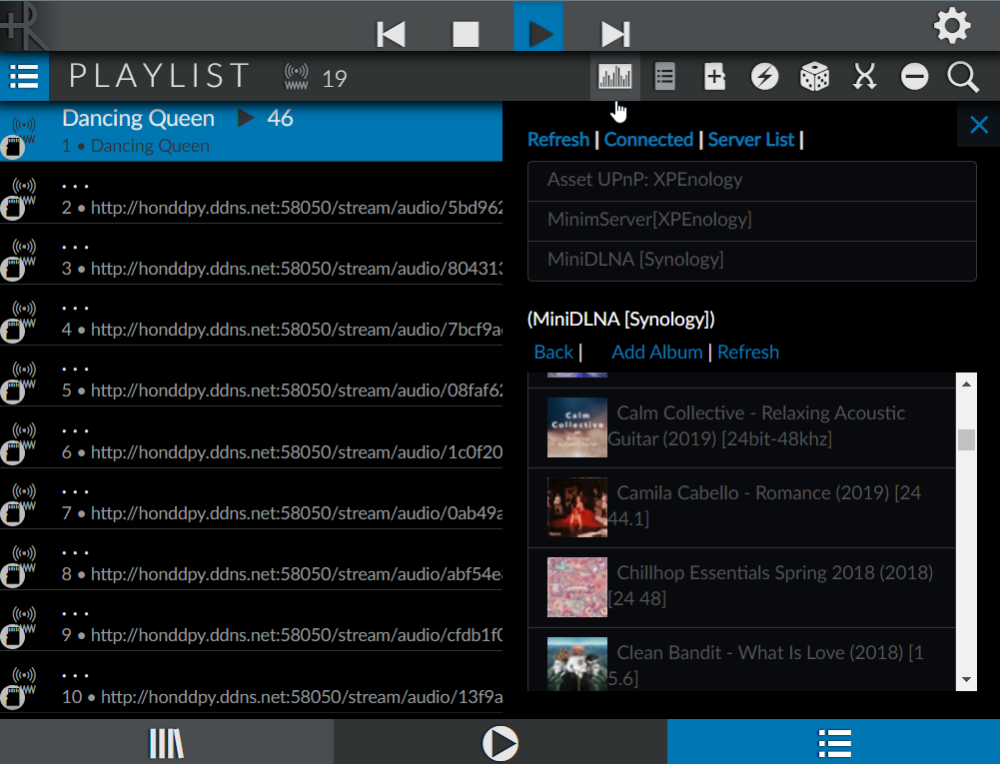

# Play your music on BubbleUPnP Server (Local or Internet) with rAudio

1./ **Install**
> wget -O - https://raw.githubusercontent.com/lovehifi/raudiobub/main/install.sh | sh 
> 
> 
> 
> 

>
####
####
2./ **How use**
> 
Use rAudio to connect to BubbleUPnP Server and play your music on (Jellyfin, Emby, Asset UPnP DLNA, MinimServer, MiniDLNA, etc).
> 
You need to install BubbleUPnP Server on your NAS, PC or Pi and also install Jellyfin or Emby Server
> 
You can install other Asset UPnP DLNA, MinimServer, MiniDLNA, etc., for BubbleUPnP Server.
> 
BubbleUPnP Server will automatically detect all servers for the Media Server tab
> 
3./ **Config**
> 
In rAudio, the Playlist tab, click the VU icon.
> 
Add: username, password, Server URL (BubbleUPnP Server): local-ip:58050 or your-website.ddns.net:58050
>
> 
2./ **Play**
> Choose Server, Choose Music, Add Album
>

>

